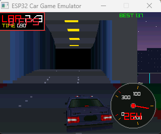

# ESP32 Pseudo-3D Racing Game

An OutRun-style pseudo-3D racing game for the ESP32-S3 microcontroller with an ILI9341 320×240 SPI display. The same source compiles for both ESP32 hardware and Windows (via a Raylib-based emulator).

---

## Screenshots




---

## Features

- **Pseudo-3D road rendering** — segment-based back-to-front painter's algorithm, classic arcade style
- **3D player car** — OBJ mesh (428 vertices, 312 triangles) with scanline affine texture mapping and shadow
- **Traffic system** — 6 AI cars with independent speeds and lane positions
- **Procedural track** — randomized curves, elevation changes, tunnels, and buildings generated at startup
- **Dynamic scenery** — pine trees, bushes, rocks, lamp posts, and 3D buildings with window patterns
- **Day / sunset / night cycle** — smooth color palette transitions every ~180 km of distance
- **Atmospheric fog** — exponential density toward the horizon
- **Physics** — acceleration, friction coast-down, centrifugal drift on curves, hill gravity effects
- **Collision detection** — crash with 2-second recovery
- **Lap timing** — current and best lap displayed on the HUD
- **HUD** — circular speedometer (0–300 km/h) with needle

---

## Hardware

| Component | Details |
| --------- | ------- |
| MCU | ESP32-S3, 240 MHz dual-core, 8 MB PSRAM |
| Display | ILI9341 TFT, 320×240, 16-bit RGB565 |
| Input | 2 pushbuttons — GPIO 17 (left), GPIO 16 (right) |
| Backlight | GPIO 39 PWM |
| SPI | SCK=12, MOSI=11, MISO=13, CS=10, DC=9, RST=8 |

Compiling for hardware: open in **Arduino IDE**, select **ESP32-S3 Dev Module**, install the **TFT_eSPI** library, then compile and upload.

---

## Controls

| Action | Hardware | Emulator |
| ------ | -------- | -------- |
| Steer left | GPIO 17 button | Left arrow key |
| Steer right | GPIO 16 button | Right arrow key |
| Throttle | Automatic (autopilot) | Automatic |

---

## Build — Emulator (Windows)

The emulator uses [Raylib](https://www.raylib.com/) to render the display and mock the Arduino API.

```bash
cd emulator/
make
./car_game_emu.exe
```

Kill and rebuild:

```bash
taskkill /F /IM car_game_emu.exe 2>nul
rm -f car_game_emu.exe && make
```

---

## Project Structure

```text
car_game/
├── car_game.ino           # Main game loop
├── config.h               # All tunable constants
├── structs.h              # Segment, RenderPt, TrafficCar data structures
├── physics.cpp/.h         # Speed, drift, gravity, collisions, lap timing
├── track.cpp/.h           # Procedural track generation
├── render_road.cpp/.h     # Road, tunnel, buildings, fog
├── render_player.cpp/.h   # 3D player car (OBJ + scanline texture)
├── render_traffic.cpp/.h  # Traffic car geometry
├── render_building.cpp/.h # 3D buildings with window styles
├── render_hud.cpp/.h      # Speedometer and lap times
├── colors.cpp/.h          # RGB565 palette, day/night/sunset lerp
├── utils.cpp/.h           # easeInOut, expFog, lerpF, clampF, findSegIdx
├── car2_mesh.h            # Generated: OBJ mesh as C static array
├── car2_texture.h         # Generated: 128x128 RGB565 texture
├── assets/
│   ├── Car2.obj
│   ├── car2.png
│   ├── obj_to_header.py
│   └── png_to_rgb565.py
└── emulator/
    ├── Arduino.h              # Mock Arduino API (millis, random, digitalRead)
    ├── TFT_eSPI.cpp           # Maps sprite draw calls to Raylib
    └── car_game_wrapper.cpp   # Includes ../car_game.ino as C++
```

---

## Key Constants (`config.h`)

| Constant | Default | Description |
| -------- | ------- | ----------- |
| `SPEED_MULTIPLIER` | 65.0 | Max speed (~246 km/h) |
| `FRICTION` | 0.996 | Coast-down rate (~3.3 s from max) |
| `CENTRIFUGAL` | — | Curve lateral drift force |
| `GRAVITY_FACTOR` | — | Hill acceleration effect |
| `ROAD_W` | 2000 | Road half-width in world units (~10.5 m real) |
| `SEG_LEN` | 200 | Segment length in world units |

Building density: `BUILDING_H_MIN/MAX`, `BUILDING_SEG_MIN/MAX`, `BUILDING_GAP_MIN/MAX`.

---

## Regenerating Asset Headers

If `assets/Car2.obj` or `assets/car2.png` change, regenerate the C headers:

```bash
# OBJ mesh -> C header (requires Python 3)
python assets/obj_to_header.py assets/Car2.obj > car2_mesh.h

# PNG texture -> RGB565 C header (requires Pillow)
python assets/png_to_rgb565.py assets/car2.png > car2_texture.h
```

---

## Architecture Notes

**Rendering pipeline** — one back-to-front loop per frame:

1. Sky (parallax background with road-curve offset)
2. Road segments with fog, curb stripes, lane markings
3. Tunnels and buildings (painter's order, farthest first)
4. Traffic cars
5. Player car — OBJ mesh, Z-sorted triangles, scanline affine texture mapping
6. HUD overlay
7. `spr.pushSprite(0,0)` — flip double buffer to display

**Double buffering** — the full 320×240 RGB565 frame is composed in PSRAM before being pushed to the display, eliminating tearing.

**World scale** — `ROAD_W = 2000` units ~= 10.5 m, so 1 unit ~= 5.25 mm.

**Emulator internals** — `emulator/car_game_wrapper.cpp` `#include`s `../car_game.ino` so it compiles as C++ without modification. All Arduino API calls and TFT draw calls are transparently remapped to Raylib.
